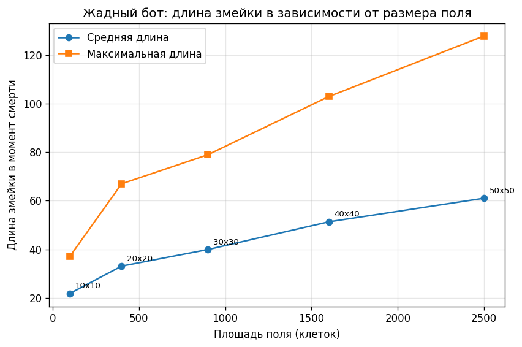
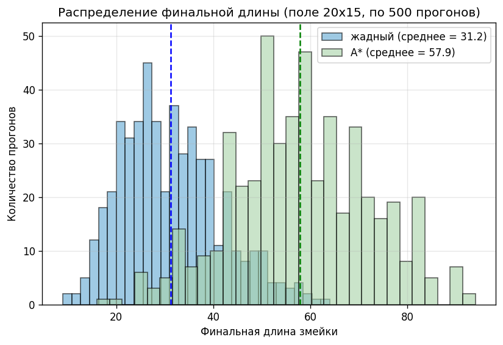
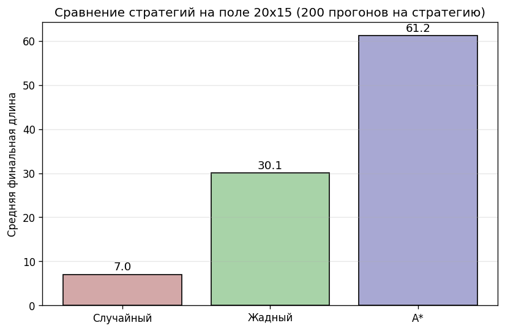
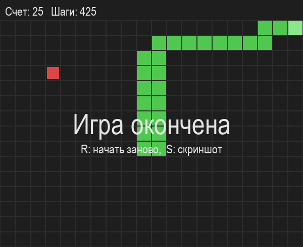

# Отчет по проекту: «Змейка»

## 1. Описание реализации

Проект разделен на пять файлов. Каждый файл отвечает за свою задачу:
- `snake_core.py` содержит основную логику игры: класс `Snake`, движение, проверку столкновений и размещение еды
- `game.py` это сама игра с управлением стрелками, перезапуском по кнопке R и сохранением скриншота по кнопке S. В верхней панели отображается счет (текущая длина змейки) и число сделанных шагов
- `bot.py` содержит три стратегии бота: `random_bot`, `greedy_bot` и `astar_bot`
- `simulate.py` прогоняет ботов в трех экспериментах и сохраняет результаты в CSV
- `analyze.py` строит графики

### Стратегии бота

1. Случайный бот (`random_bot`) выбирает случайное безопасное направление

2. Жадный бот (`greedy_bot`) из безопасных направлений выбирает то, которое уменьшает манхэттенское расстояние до еды, но при этом он не учитывает форму змейки и тупики

3. Бот A* (`astar_bot`) ищет кратчайший путь от головы до еды алгоритмом A* по свободным клеткам, тело змейки считается препятствием. Если же пути нет, то бот откатывается к жадной стратегии

### Параметры игры

В начале файла `game.py` можно поменять:
- размер поля (`WIDTH`, `HEIGHT`)
- размер клетки в пикселях (`CELL`)
- скорость в кадрах в секунду (`FPS`)
- начальную длину змейки (`START_LENGTH`)

### Как запускать

```bash
python game.py # поиграть самому
python simulate.py # прогнать все симуляции
python analyze.py # построить графики
```

### Можно посмотреть, как играет бот

```bash
python game.py random # случайный бот
python game.py greedy # жадный бот
python game.py astar # бот A*
```

Стрелки в этом режиме отключены, но кнопки R (перезапуск), S (скриншот) и Esc (выход) работают. Скорость регулируется параметром `FPS` в начале файла `game.py`

---

## 2. Результаты симуляций

### Эксперимент 1: влияние размера поля

Здесь я запускала жадный бот (по 100 прогонов) на полях разного размера: 10x10, 20x20, 30x30, 40x40 и 50x50



Видно, что средняя длина растет с увеличением поля. Но важно заметить, что на поле 10x10 средняя длина была чуть больше `20`, а на поле 50x50 она выросла до `60` с копейками. То есть площадь увеличилась в 25 раз (2500 / 100 = 25), а средняя длина `выросла лишь в 3 раза`. Максимум по длине тоже показывает 37 на самом маленьком поле, 128 на 50x50 (`менее, чем в 4 раза разница`)

### Эксперимент 2: распределение финальной длины

Поле 20x15, 500 прогонов на каждого бота (жадный и A*).



**Жадный бот:** среднее `31,2`, минимум `9`, максимум `64`. Чаще всего змейка погибает с длиной `от 20 до 35`

**Бот A*:** среднее `57,9`, минимум `16`, максимум `94`. Чаще всего змейка погибает с длиной `от 45 до 70`

### Эксперимент 3: сравнение стратегий

Три стратегии я запускала по 200 раз на поле 20x15



Средняя длина случайного бота: `7`
Средняя длина жадного бота: `30,1`
Средняя длина бота A*: `61,2`
Жадный бот живет примерно `в 4 раза дольше` случайного, а A* `в 2 раза дольше` жадного

---

## 3. Выводы

1. Видно, что при росте размера поля длина змейки увеличивается, но с замедлением. Кривая растет медленнее, чем линейно (площадь в 25 раз, а длина в 3), но и быстрее логарифма (логарифм дает в 1,7 раза). Но, как по мне, можно сравнить рост длины змейки с ростом не площади поля, а его стороны (сторона в 5 раз, а длина в 3). Да, они не равны, но это во всяком случае дает более корректный ответ, нежели линейная или логарифмическая зависимость

2. У обоих ботов (жадного и A*) распределения длины широкие и имеют похожую форму в виде колокола с пиком в середине. У жадного пик в районе 25-30, у A* в районе 50. Видно, что A* просто сдвигает все распределение вправо, и получается, что A* не меняет характер игры, а только улучшает средний результат. Также из графика видно, что такой разброс связан не со стратегией бота, а со случайностью расположения еды. Если еда часто появляется рядом, то бот растет быстро и без сложных маневров, а если еда появляется в дальних углах, то бот должен обходить свое большое тело, и шанс того, что он запрет самого себя, большой. То есть результат сильно зависит не только от качества стратегии, но и от удачи

3. A* дает результат в 2 раза лучше жадного, но не выигрывает. Жадный бот видит только следующий шаг и не понимает, ведет ли этот шаг в тупик. А вот A* умеет находить путь к еде вокруг препятствий, поэтому он реже застревает в ловушках. Но и у A* есть проблема, что он ищет путь только до еды и не проверяет, останется ли после этого пути куда отступить. То есть он может дойти до еды, но при этом замкнуть себя в кольцо. Из 300 возможных клеток A* в среднем занимает только 61, и чтобы пройти игру до конца, нужна стратегия, которая планирует не один путь, а несколько шагов вперед и учитывает доступ к собственному хвосту

---

## 4. Скриншот игры


